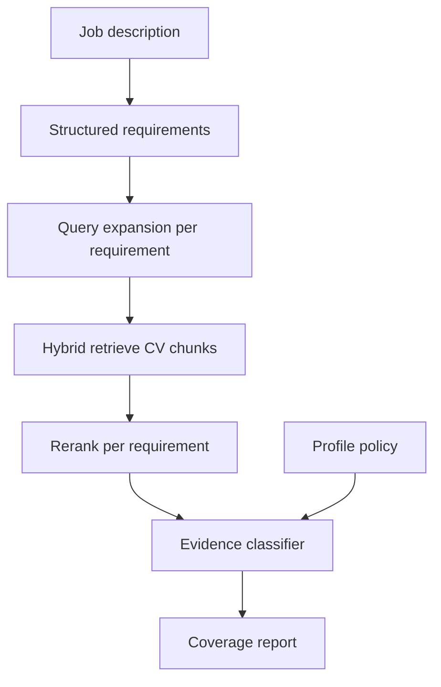

# AI Job Scout — Requirement-Level RAG Sample

Public excerpt of **AI Job Scout**, a local-first job-fit tool. This repo is the **requirement-level RAG and evidence classification** layer: per-must-have retrieval, hybrid search, rerank, and **strong / adjacent / weak / missing** coverage — with tests and a runnable demo on fictional data only.

Further reading: [`docs/REQUIREMENT_LEVEL_RAG_FOR_JOB_FIT.md`](docs/REQUIREMENT_LEVEL_RAG_FOR_JOB_FIT.md)

**Gist (writing + UI screenshots):** https://gist.github.com/safalex/499a961cf050fcd435ad0917f51bbbf0 — code stays in this repo; gist shows the product in use. Refresh: `CODE_REPO_URL=https://github.com/YOU/ai-job-scout-sample ./scripts/publish-application-gist.sh 499a961cf050fcd435ad0917f51bbbf0`

---

## What this sample demonstrates

- Structured requirements decomposed from a job description (demo uses pre-filled extraction).
- **Per-requirement** hybrid retrieval and rerank over chunked CV text — not one global similarity score.
- Four-level evidence classification with explicit handling of **adjacent** vs **strong** for specialist must-haves.
- Regression tests and a golden eval case for a known false-positive scenario (platform CV vs storage-specialist role).
- CLI demo that prints coverage, reasons, and the distinction between **supporting evidence** and **inspected-but-rejected** chunks.

---

## Problem

Job search tools often optimise for similarity. That produces **false positives**: a platform engineer CV looks plausible for a storage-infrastructure role because both mention distributed systems, even when there is no evidence for Ceph, block storage, or filesystem internals.

This sample shows how to **withhold** a strong match recommendation when specialist proof is missing — while still showing which chunks were retrieved and why they were rejected.

---

## Why whole-document similarity is not enough

| Approach | Limitation |
|----------|------------|
| Single embedding match (JD ↔ CV) | Blends unrelated must-haves; one strong area masks weak areas |
| Top-k chunks without per-requirement scoring | Platform bullets surface for storage reqs via shared vocabulary |
| LLM “does this look like a fit?” on retrieved text | Hard to test; tends to agree with superficial overlap |

**Requirement-level RAG** retrieves and classifies **each must-have separately**, so a strong Python hit does not imply strong Ceph coverage.

---

## Architecture



**Key modules:** `scout/rag/pipeline.py` (entry), `scout/rag/requirements.py`, `scout/rag/evidence.py`, `scout/cv_engine/evidence_strength.py`, `scout/config/profile_policy.py`.

---

## How requirement-level RAG works

1. Build `PrimaryRequirement` rows from JD extraction + optional role centre (e.g. `storage_infrastructure`).
2. Expand queries per requirement (synonyms, profile vocabulary).
3. Hybrid retrieve from in-memory fixture chunks (hash embeddings + keyword fusion).
4. Rerank hits in requirement context.
5. Classify each row → aggregate `RequirementCoverageReport` (direct / adjacent / missing buckets).

Entry point: `retrieve_for_requirements_v2()` in `scout/rag/pipeline.py`.

---

## Evidence labels: strong / adjacent / weak / missing

| Label | Meaning |
|-------|---------|
| **strong** | Direct proof in retrieved experience (profile tier + chunk text) |
| **adjacent** | Transferable, but **not** sufficient for specialist must-haves |
| **weak** | Partial or skills-list-only hit |
| **missing** | No qualifying evidence; specialist adjacent downgrades here |

**Skills sections are downgraded** — keyword lists do not prove delivery depth.

**Missing coverage output:** related chunks may appear as `inspected chunks (retrieved but insufficient)` in the CLI, or `inspected_chunks` with `used_as_evidence: false` in JSON — not as supporting citations.

---

## Why deterministic gates and structured outputs matter

In the full application, **hard eligibility** (location, title, role centre) and **profile policy** run before expensive model calls. This sample implements the RAG layer; gates are described in the design but not fully shipped here.

**Structured outputs** (Pydantic models for requirements, coverage rows, chunk refs) keep analyse results consistent for tests, caching, and UI — and make false-positive regressions enforceable in CI.

---

## How to run

Requires **Python 3.11+**.

```bash
python3 -m venv .venv
source .venv/bin/activate   # Windows: .venv\Scripts\activate
pip install -e ".[dev]"
pytest -q
python scout/sample/demo.py
```

No API keys, database, or network access required.

---

## Tests

```bash
pytest -q
```

**12 tests**, including:

- Storage role: Ceph must not strong-match platform CV; missing rows use `inspected_chunks`, not `evidence_chunks`
- Ecommerce CV not strong on AI-platform specialist requirements
- Skills-only chunks downgraded strong → weak
- Profile avoid-overclaiming tier → missing for specialist terms

Golden case: `evals/rag_cases/acme_storage.json`

---

## Example output

```
=== Requirement-level RAG demo ===
Job: Staff Platform Engineer — Storage @ Acme Cloud
Role centre: storage_infrastructure

- Ceph production clusters
  coverage: missing
  reason: Retrieved related chunks but none qualify as direct evidence.
  inspected chunks (retrieved but insufficient): chunk#201, chunk#202, chunk#301

- Experience with Python
  coverage: strong
  reason: Direct evidence for Experience with Python.
  evidence: chunk#202, chunk#102, chunk#201

Summary buckets:
  direct: ['Experience with Python']
  missing/risk: ['Ceph production clusters', 'distributed block storage', ...]
```

Full capture: [`examples/sample_output.txt`](examples/sample_output.txt)

---

## What is intentionally excluded from the public sample

- Live job scraping and real postings
- Private CVs, profiles, and application tracker data
- SaaS tenancy, production database, FastAPI UI
- LangGraph analyse workflow (present in the full local app)
- LLM requirement extraction (demo uses pre-filled `JDRequirementsExtraction`)

Fixtures in `fixtures/` and `evals/` are fictional only.

---

## What I would improve next

1. Live LLM requirement extraction with strict Pydantic schema validation
2. Cross-encoder reranker per requirement
3. Broader eval harness (precision/recall on coverage buckets)
4. Outcome calibration — log apply/review/skip against predictions

---

## License

MIT — see [LICENSE](LICENSE).
