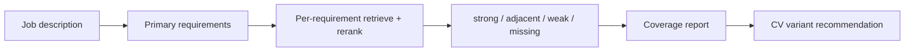

# Requirement-level evidence for job-fit tools

Most job-matching tools optimise for similarity: compare the CV with the job description, retrieve similar chunks and produce a match score. That approach is cheap, but it creates false positives. A platform engineer CV can look similar to a storage-infrastructure role because both mention distributed systems, even when the CV has no evidence for Ceph, block storage or filesystem internals.

**AI Job Scout** takes a different approach: **the requirement is the unit of work**.

---

## Pipeline overview

1. **Decompose** the posting into primary requirements (must-haves, stack items, role-centre primaries).
2. **Retrieve** CV chunks per requirement — hybrid semantic + keyword search with query expansion.
3. **Rerank** hits in the context of that single requirement.
4. **Classify** coverage as **strong**, **adjacent**, **weak**, or **missing**.
5. **Aggregate** into a coverage report and CV variant recommendation upstream.

Deterministic gates (location, title, specialist role centres) and profile policy run before expensive model calls. Structured outputs use Pydantic schemas so downstream ranking and UI stay consistent.



---

## Why adjacent is not enough

Adjacent evidence is transferable language — useful context, not proof. For specialist must-haves, adjacent must not satisfy the requirement.

Example: “distributed systems” and “platform engineering” may appear in both a platform CV and a storage-infrastructure posting. That overlap is **adjacent** at best. It is not **strong** evidence of operating Ceph production clusters or designing network storage clusters.

In the public sample, role-centre primaries for storage infrastructure are marked `importance=specialist`. Adjacent hits on those requirements downgrade to **missing**, so the pipeline does not emit a high-confidence apply nudge on keyword proximity alone.

---

## False-positive regression: storage infrastructure

The sample repo encodes this failure mode as a golden eval case (`evals/rag_cases/acme_storage.json`) and pipeline tests (`test_storage_job_does_not_strong_match_ceph`).

Given fixture CV chunks from platform and AI-platform variants:

- Hybrid retrieval **does** surface superficially related chunks (Kubernetes skills, LLM platform bullets).
- Classification must **not** mark Ceph or distributed block storage as **strong**.
- Demo CLI output labels those rows as **missing**, with **inspected chunks (retrieved but insufficient)** — not citations that imply support.

| Coverage | CLI chunk label | JSON |
|----------|-----------------|------|
| strong | `evidence` | `evidence_chunks`, `used_as_evidence: true` |
| adjacent / weak | `citations` | `evidence_chunks`, `used_as_evidence: true` |
| missing | `inspected chunks (retrieved but insufficient)` | `inspected_chunks`, `used_as_evidence: false`; `evidence_chunks` empty |

Skills-section chunks are downgraded separately: listing “Kubernetes, Python, Docker” is weak proof of delivery depth and cannot inflate a requirement to **strong**.

---

## When the pipeline endorses

The same code path produces the opposite outcome when evidence clusters on one CV variant.

Fixture chunks for an ecommerce integrations profile cite Adobe Commerce module work, Shopify migration, payment and logistics API integrations, and OpenSearch catalog synchronisation — experience bullets, not keyword lists. Multiple primary requirements can receive **strong** coverage; lane routing selects the ecommerce CV variant.

Same pipeline. Different evidence shape. **Withhold** auto-recommend vs **eligible for ranking** depends on whether specialist must-haves have direct proof.

---

## Design principle

Good job-fit tooling should **reduce bad applications**, not maximise optimistic match scores. A clear skip — with inspectable reasons — is more useful than a flattering percentage.

The public repo (`ai-job-scout-sample`) is a sanitised slice of a local-first application I run for my own search: full UI, analyse workflow, and multiple CV variants in the private app; fictional fixtures and tests in the sample so reviewers can verify behaviour without private data.

---

## Runnable check

```bash
pip install -e ".[dev]"
pytest -q
python scout/sample/demo.py
```

Example output: `examples/sample_output.txt`
